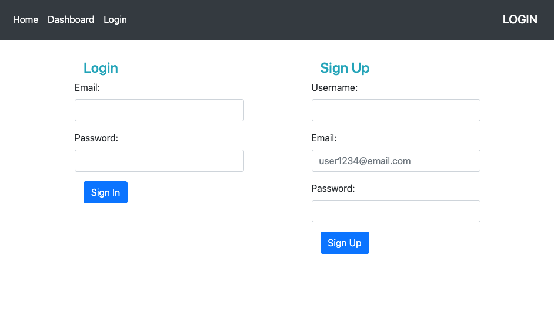
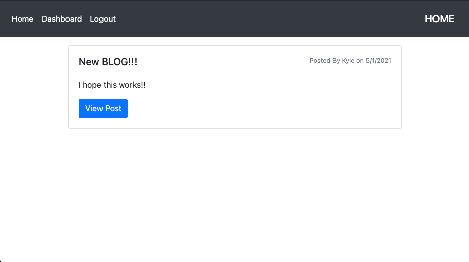
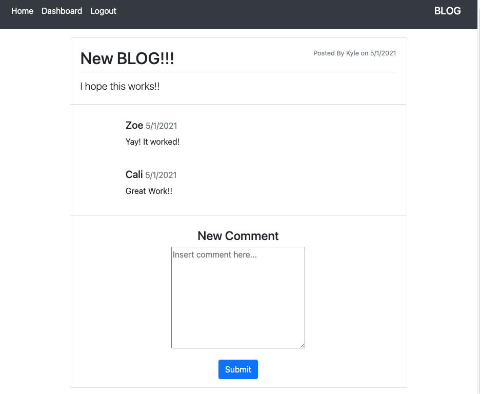
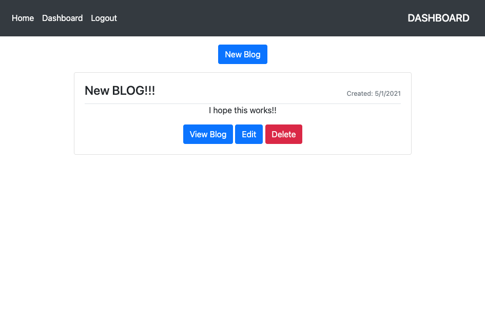
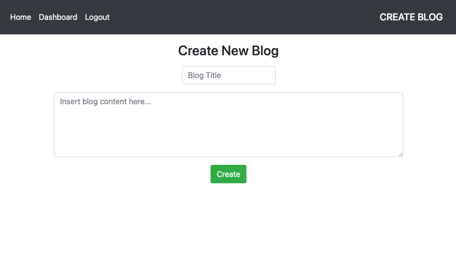
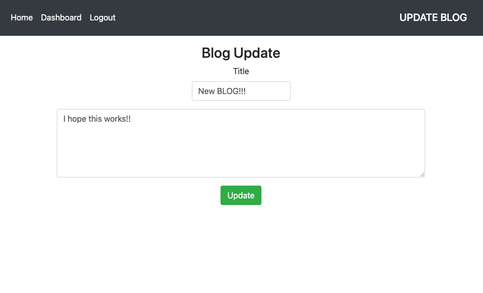

# Tech-Blog
OSU Bootcamp HW 14

## Description

An MVC app that allows users to login or sign up to create new, update or delete existing, and comment on other user's blogs!

## Technologies Used

* MVC file structure
* Javascript
* NodeJS
* npm
* dotenv
* mysql2
* express
* sequelize
* express-session
* express-handlebars
* Heroku to deploy live app

## Table of Contents

- [Screenshots](#screenshots)
- [Installation](#installation)
- [Contribute](#contribute)
- [Questions](#questions)
- [License](#license)

## Screenshot

### Login/Sign Up

### Home

### View blog with comments and option to add new comment

### Dashboard with all blogs from logged in user

### New blog form

### Update/edit blog

## Installation

Using the terminal, clone the repository to your local device using SSH or HTTPS. Once cloned, open repository in a text editor to make changes.

## Contribute

Please refer to [Contributor Covenant](https://www.contributor-covenant.org/version/2/0/code_of_conduct/) for contribution guidelines

## Questions

Created by: [Youngin9210](https://github.com/Youngin9210)

For any further information or questions please contact me at [kyleyoung.9210@gmail.com](mailto:kyleyoung.9210@gmail.com)